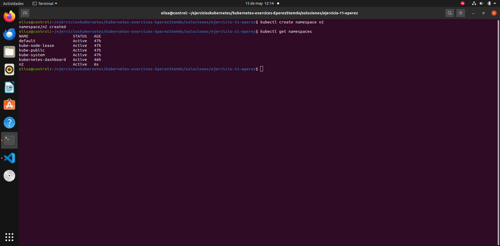
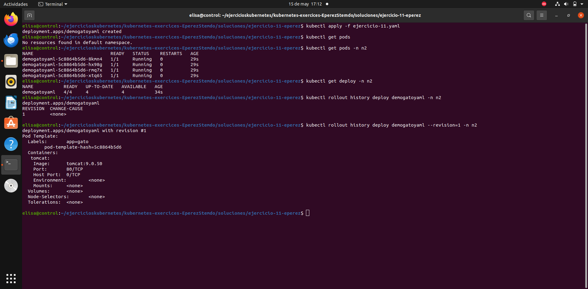
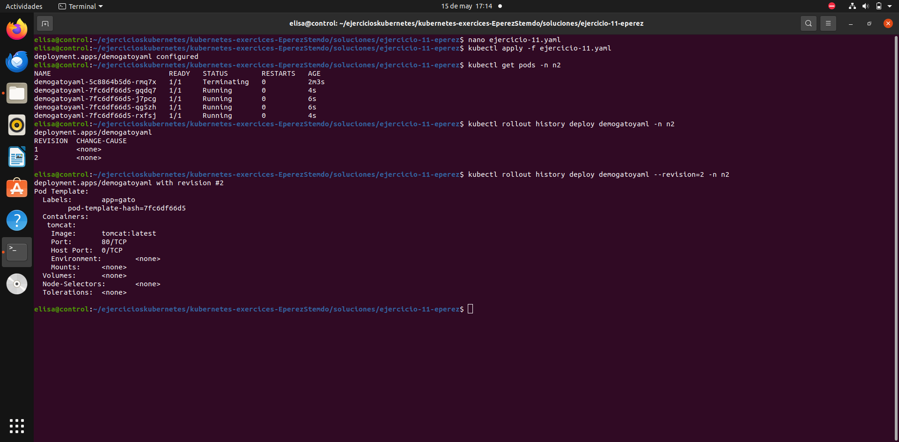
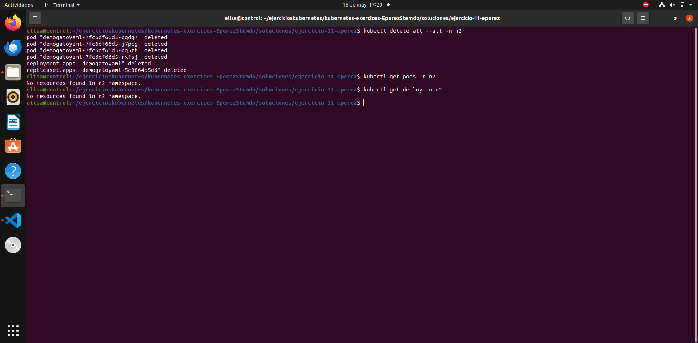

# Ejercicio 11

### Crear namespace con nombre n2

### Crear deployment 

Se crea el deployment de forma declarativa y se muestra el histórico del rollout. Se puede ver que solo hay una revisión. Entrando en ella se puede ver que la versión de la imagen es ``9.0.50``.

### Mofidicar deployment

Se modifica el deployment cambiando la versión a ``latest`` y se aplican los cambios del deployment. Ahora, al entrar en el histórico hay una revisión número 2 donde se puede ver que la versión de la imagen ha cambiado a ``latest``.

Los cambios del tag de la imagen se han hecho utilizando el editor de texto nano.

### Limpiar recursos 

