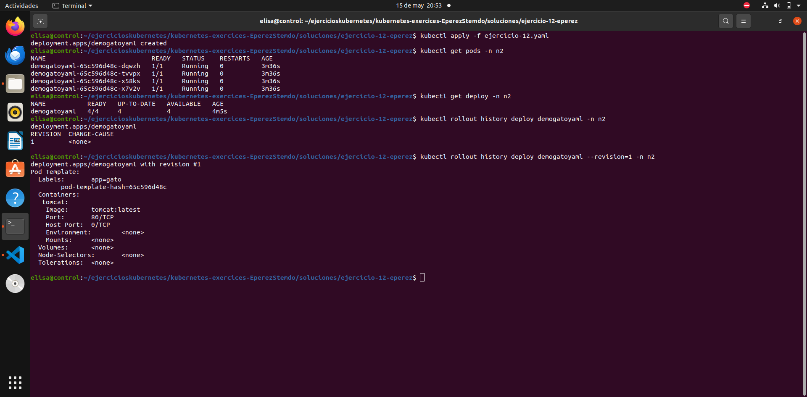
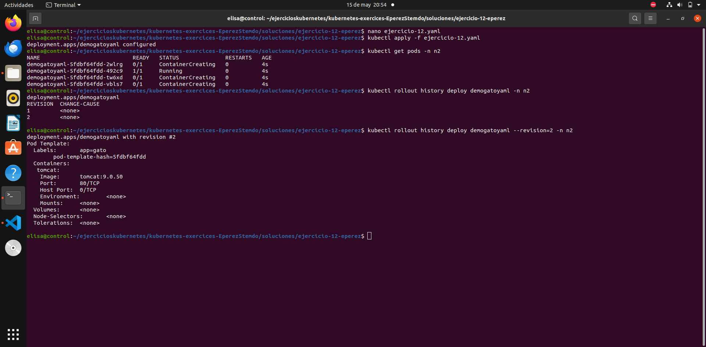
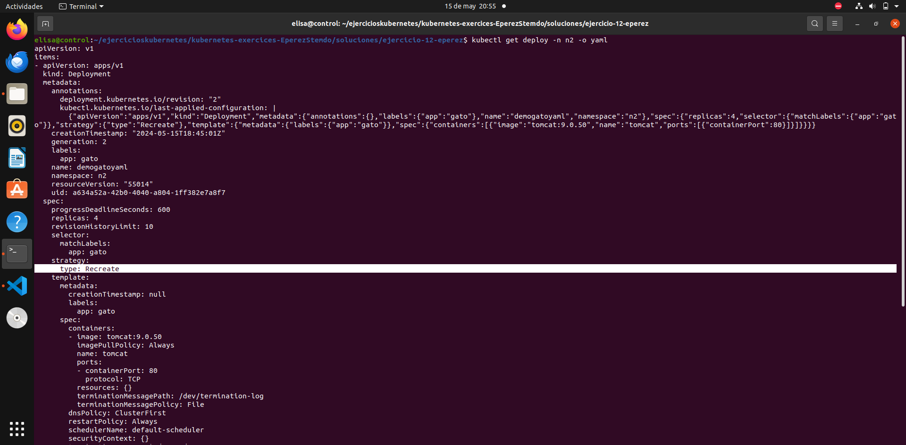

# Ejercicio 12

Se trata del mismo procedimiento que en el ejercicio anterior, cambiando el tipo de estrategia a Recreate.

### Crear deployment 

### Mofidicar deployment

### Mostrar el tipo de estrategia

