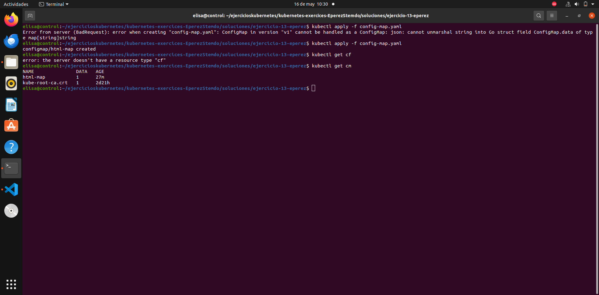
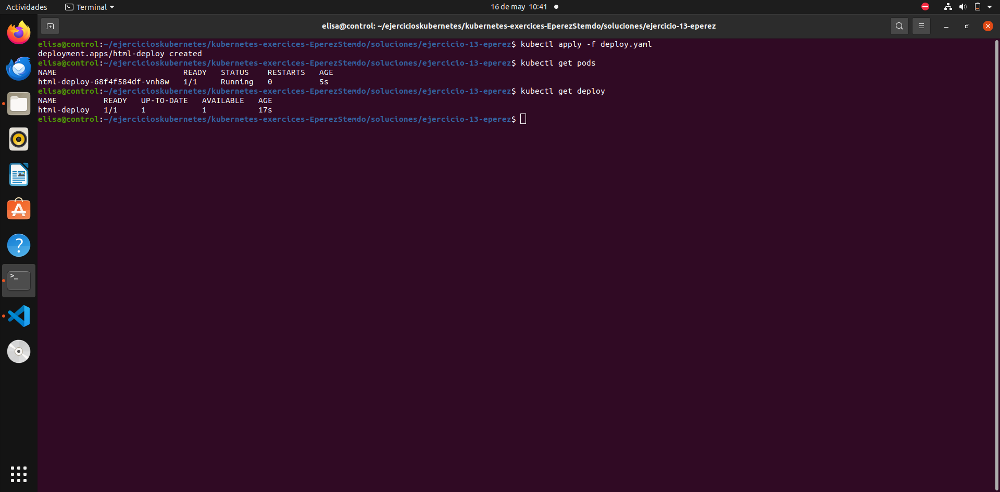
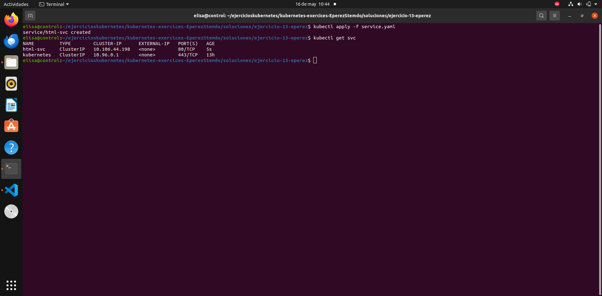
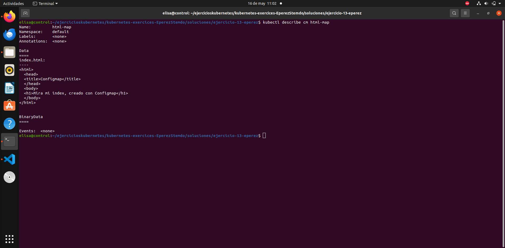
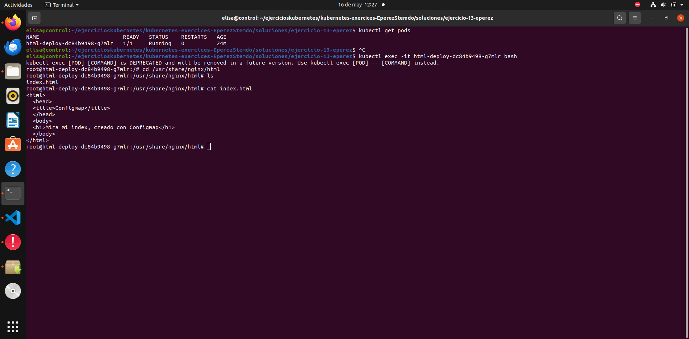
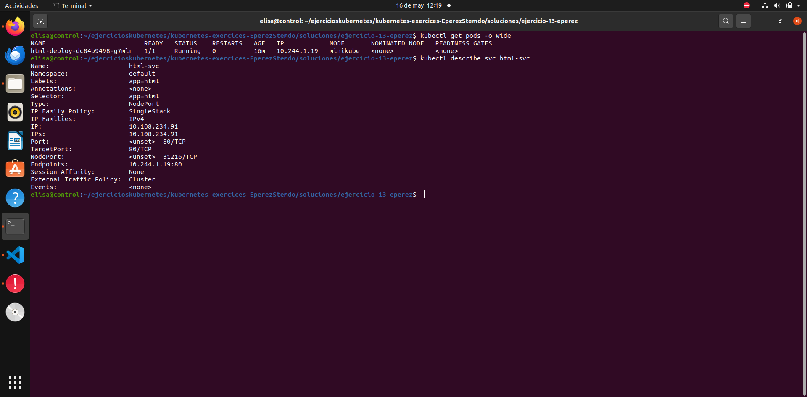
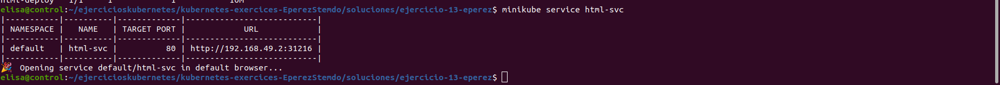
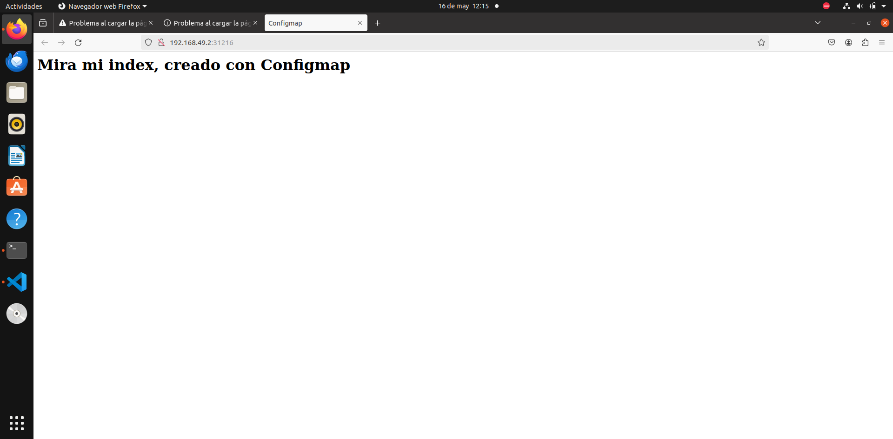

# Ejercicio 13

### Crear congifMap

Utilizando el archivo ``service.yaml`` se crea el configMap con el comando 

```
kubectl apply -f service.yaml
```




### Crear Deployment

Utilizando el archivo ``deploy.yaml`` se crea el configMap con el comando 

```
kubectl apply -f deploy.yaml
```



### Crear servicio

Utilizando el archivo ``service.yaml`` se crea el configMap con el comando 

```
kubectl apply -f service.yaml
```



### Verificar

Se verifica:

- Que el map se haya creado correctamente



- Que el archivo index.html se encuentre dentro del pod


- Que los endpoints del servicio coincidan con la ip del pod


### Comprobar que funciona



