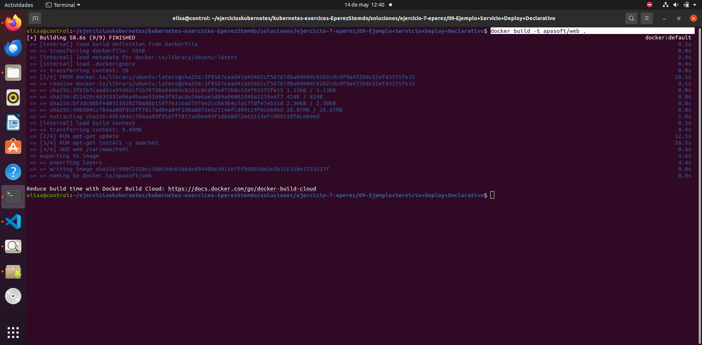
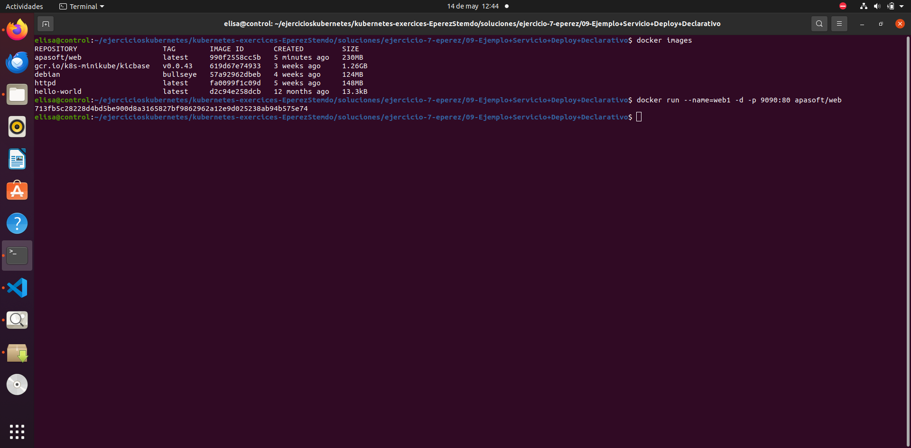
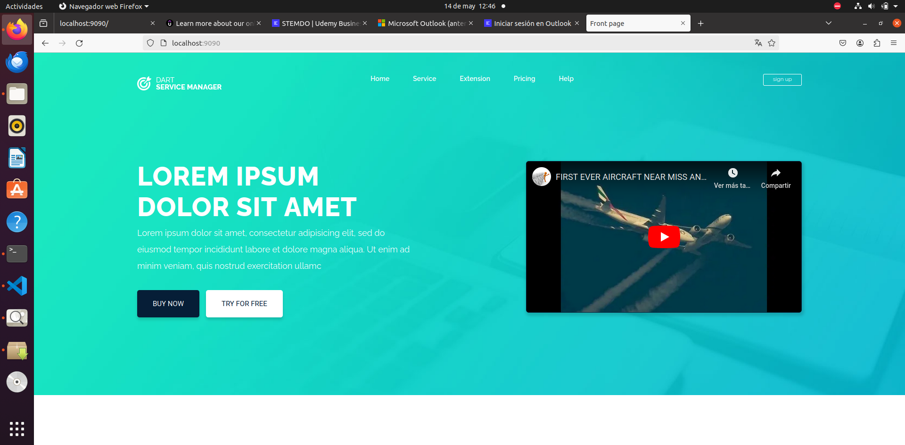
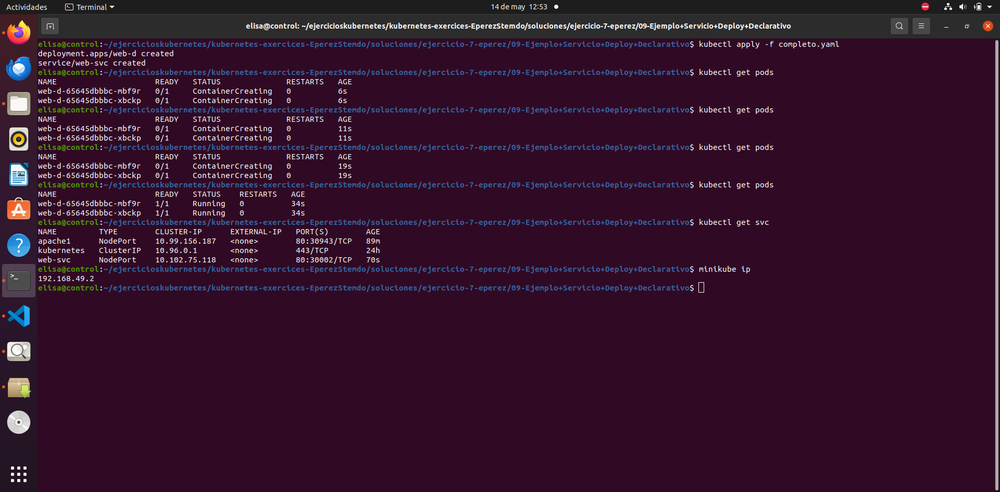
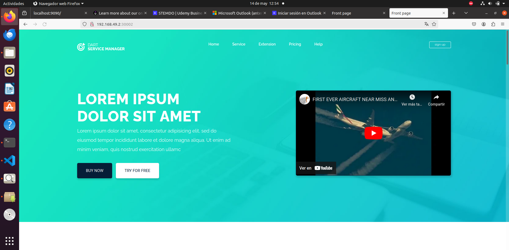

# Ejercicio 7

### Contruir la imagen

 Contruir la imagen a partir del Dockerfile

```
docker build -t apasoft/web .
```
 


### Comprobar que la app funciona

Antes de nada se comprueba que la app funciona correctamente.

-
- Crear el contenedor y comprobar que la página funciona 

```
docker run --name=web1 -d -p 9090:80 apasoft/web
```

 
 

- Detener y borrar contenedor 

```
docker stop web1
docker rm web1
```

### Crear deployment y servicio a partir del yaml

Se crean los objetos establecidos en el archivo `` completo.yaml`` que son:

- Deployment
- Servicio

Se listan los objetos creados y se comprueba que estén en el estado `` running``

 


### Comprobar que funciona

 