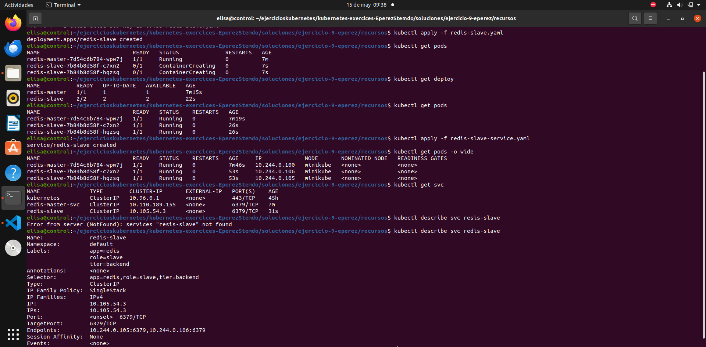
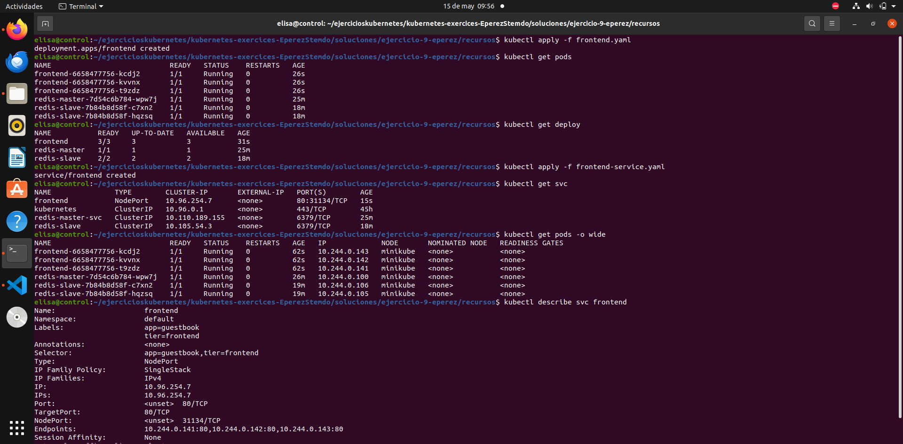
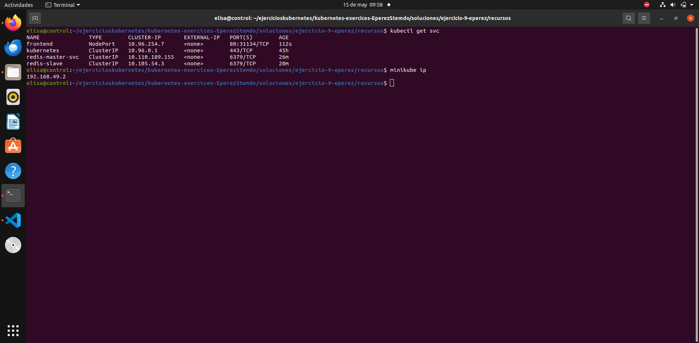
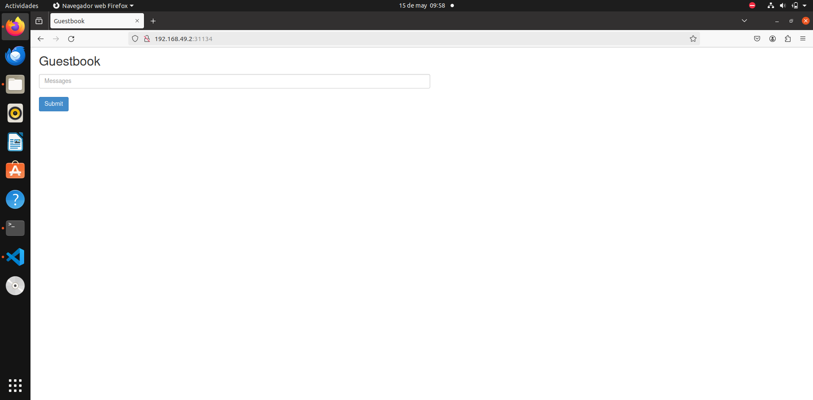

# Ejercicio 9

### Contexto

Se va a contruir una aplicación Frontend en PHP que trabaja con una base de datos redis. Para ello se necesita crear tanto el deploy como los servicios de los tres componentes:
- Redis-master: servicio tipo ClusterIP
- Redis-slave: servicio tipo ClusterIP
- Frontend: servicio tipo ClusterIP

Para los tres componentes se sigue la misma metodología:

1. Crear deployment y servicio a partir del archivo ``.yaml``

```
kubectl apply -f <file.yaml>
```
2. Comprobar que los pods, deployments y servicios se han creado y tienen un estado correcto como ``AVAILABLE`` o ``running``

```
kubectl get pods -o wide
kubectl get deploy
kubectl get svc
```
3. Comprobar que los endpoints de los servicios apuntan a las IPs de los pods

```
kubectl describe <nombre_del_svc>
```

### Redis-marter
!(./01-redis-master-deploy-svc-info.png)

### Redis-slave



### Frontend



### Comprobar la app

Primero se obtiene la ip y el puerto y después se comprueba en el navegador.






