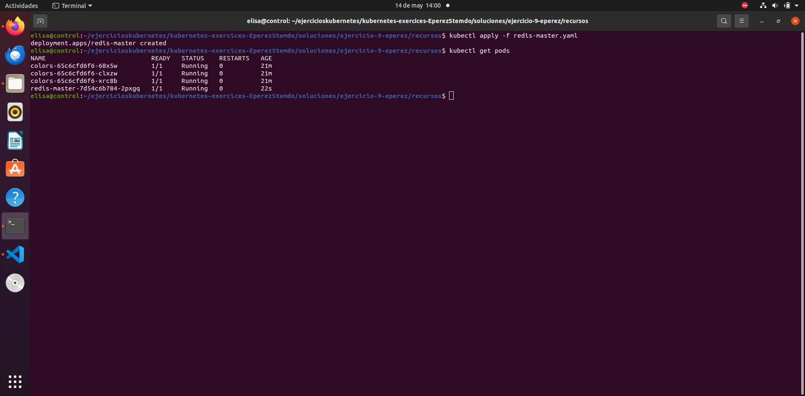
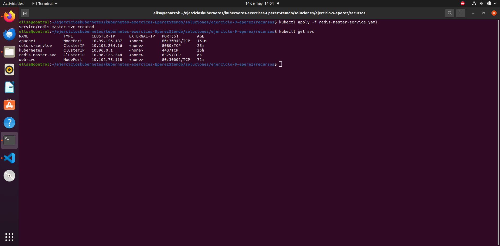
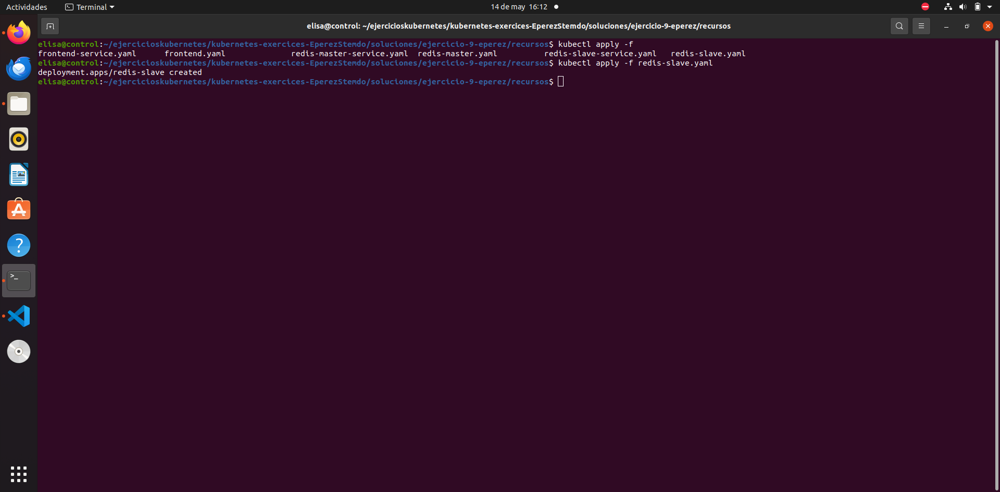
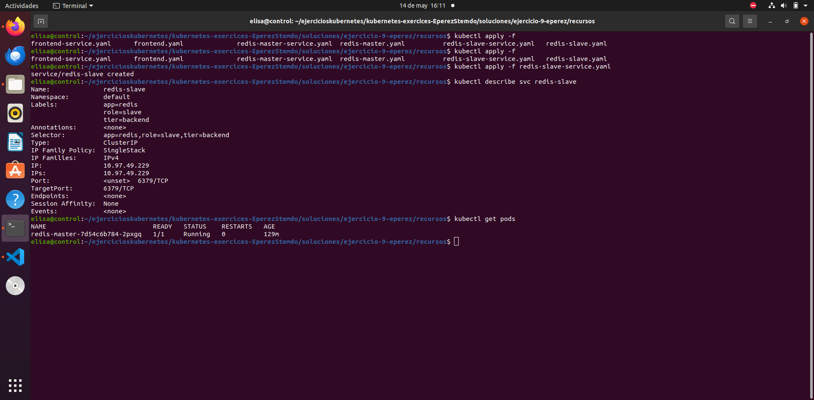

# Ejercicio 9

### Creación del deployment redis-master

### Creación del servicio redis-master

### Creación de deployment redis-slave

Se define la variabloe de entorno `` GET_HOSTS_FROM`` para determinar de dónde recupera la información de los hosts. Por defecto siempre utiliza DNS a no ser que se especifique otro valor.

### Creación del servicio redis-slave

### Creación del deployment FrontEnd PHP

